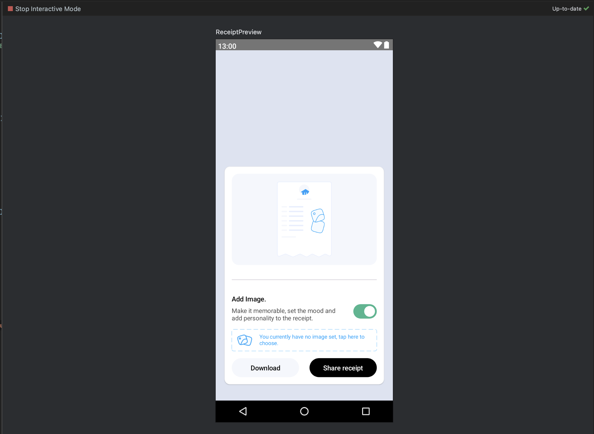

# Transaction Receipt with Compose

This project demonstrates the implementation of a transaction receipt flow using Jetpack Compose in
Android. The UI/UX design includes a feature that allows users to add a custom image asset to the
receipt.

## Features

- **Transaction Details:** Display essential transaction information such as date, amount, and
  description.
- **Custom Image Asset:** Users can add a custom image asset to personalize their transaction
  receipt.
- **Save and Share:** Save the receipt and share it with others.
- **Intuitive UI:** Clean and user-friendly interface for a seamless experience.

## Screenshots

## Credit

Flow Design inspiration from @leyeConnect on Twitter.